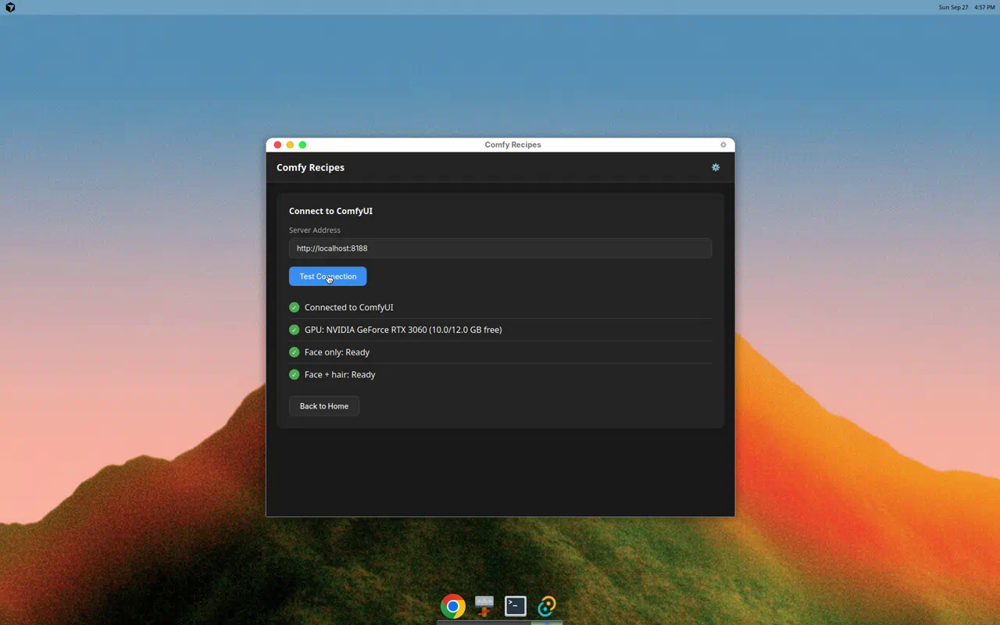
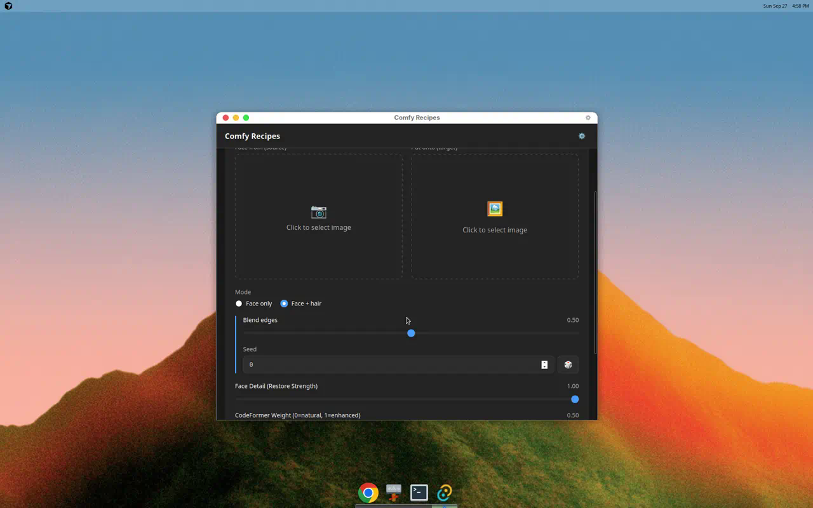
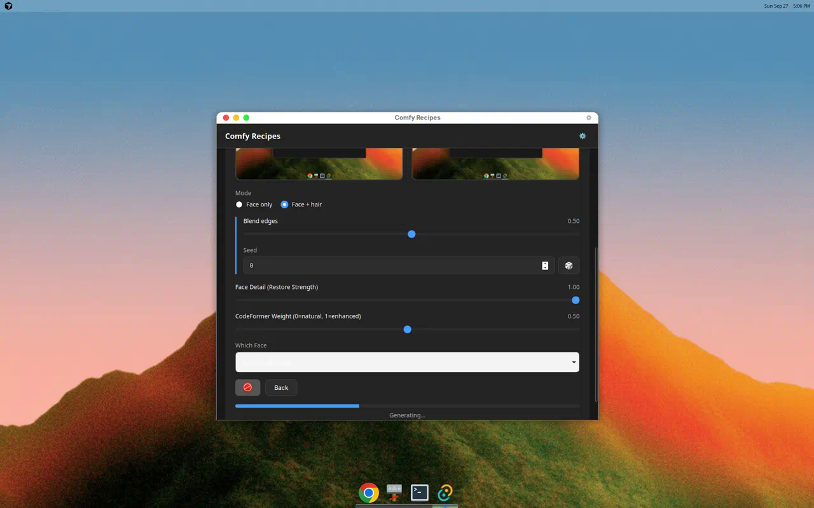
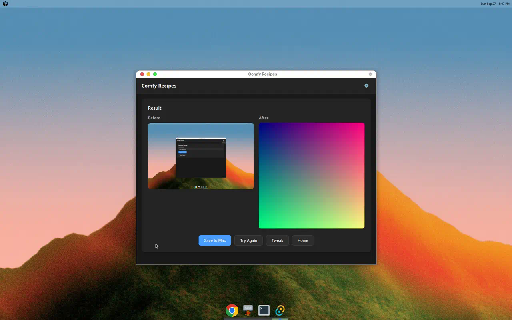
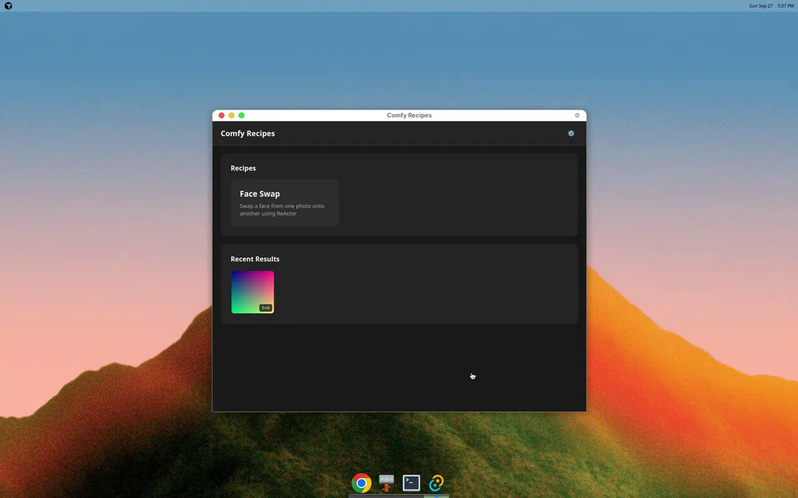
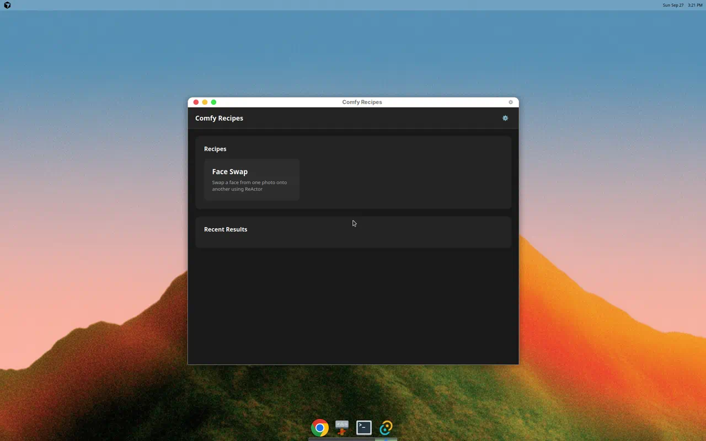
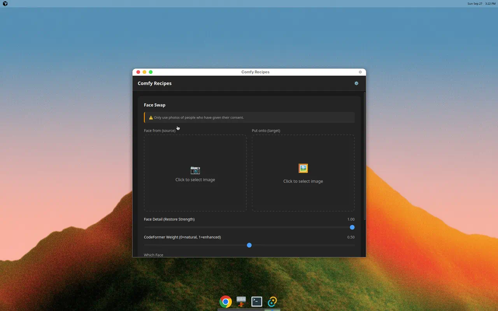
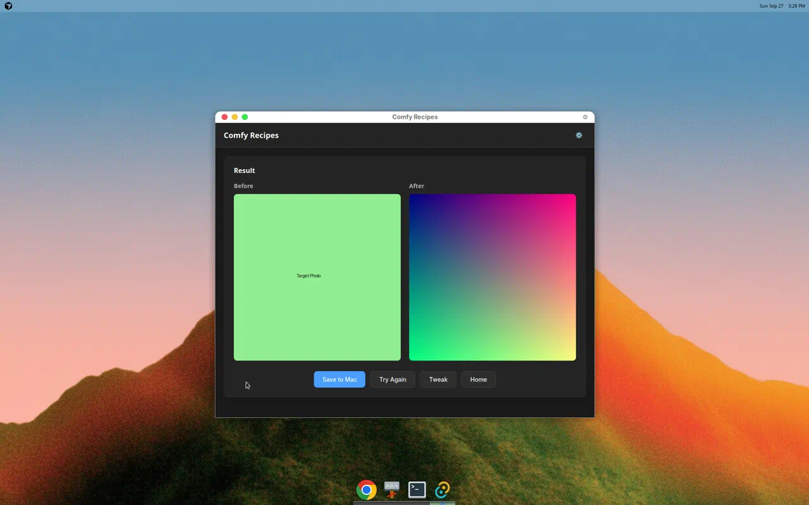

# Comfy Recipes

A Mac desktop app for running ComfyUI face-swap workflows without touching nodes. Pick a recipe, drop in photos, press Go, and get the result back.

## Features

- **Face Swap (Face only)**: Swap a face from one photo onto another using ReActor (fast, ~3 seconds)
- **Video face swap (Face only)**: Swap a source face onto a short target video (up to 10 seconds) using the same ReActor pipeline per frame; audio from the original clip is preserved when present
- **Face Swap (Face + hair)**: Replace the whole head including hair, keeping the target's body, pose, and background (SDXL + IPAdapter, ~30-60 seconds)
- **Simple UI**: No node graphs - just pick photos and adjust a few sliders
- **History**: Last 50 results saved locally with settings and mode, so you can repeat good results
- **Privacy**: Everything stays on your home network - no accounts, telemetry, or cloud services

## Screenshots

### v0.2 - Face + hair Mode
| | |
|:---:|:---:|
|  |  |
| Health check with Face + hair ready | Face + hair controls (blend edges, seed) |
|  |  |
| Face + hair job in progress | Result with before/after comparison |
|  |  |
| Face + hair greyed out when nodes missing | History with mode badge (F+H) |

### v0.1 - Face Only
| | |
|:---:|:---:|
|  |  |
| Recipe selection | Image upload and settings |
|  |  |
| Server status and GPU info | Before/after comparison |

See all screenshots in [`docs/screenshots/`](docs/screenshots/).

## Requirements

### On Your Mac
- macOS 10.15 (Catalina) or later
- **ffmpeg** for video mode: `brew install ffmpeg` (the app uses `ffmpeg` / `ffprobe` on your PATH, or set `FFMPEG_PATH` / `FFPROBE_PATH`)

### On Hades (or your ComfyUI server)
- ComfyUI running with `--listen` flag so other machines can connect
- RTX 3060 12GB or similar GPU with 12GB+ VRAM
- ReActor custom node installed

## Setting Up Hades

### 1. Start ComfyUI with --listen

```bash
cd ComfyUI
python main.py --listen
```

This allows connections from other machines on your network.

### 2. Install ReActor Custom Node

```bash
cd ComfyUI/custom_nodes
git clone https://github.com/Gourieff/ComfyUI-ReActor
cd ComfyUI-ReActor
pip install -r requirements.txt
```

Restart ComfyUI after installation.

### 3. Download Required Models

**Face swap model** (`inswapper_128.onnx`):
- Download from [InsightFace](https://github.com/deepinsight/insightface) or HuggingFace
- Place in `ComfyUI/models/insightface/`

**Face restore model** (choose one):
- `codeformer-v0.1.0.pth` - Better quality, slower
- `GFPGANv1.4.pth` - Faster, good quality

Download from [ReActor releases](https://github.com/Gourieff/ComfyUI-ReActor) or HuggingFace.
Place in `ComfyUI/models/facerestore_models/`

## Face + hair Setup on Hades

The "Face + hair" mode requires additional custom nodes and models beyond the basic Face only setup.

### Required Custom Nodes

| Repository | Install Command |
|------------|-----------------|
| [ComfyUI_IPAdapter_plus](https://github.com/cubiq/ComfyUI_IPAdapter_plus) | `cd ComfyUI/custom_nodes && git clone https://github.com/cubiq/ComfyUI_IPAdapter_plus && pip install insightface onnxruntime-gpu` |
| [a-person-mask-generator](https://github.com/djbielejeski/a-person-mask-generator) | `cd ComfyUI/custom_nodes && git clone https://github.com/djbielejeski/a-person-mask-generator && pip install mediapipe` |

Restart ComfyUI after installing custom nodes.

**Note:** The a-person-mask-generator node (`APersonMaskGenerator`) auto-downloads its segmentation model on first use.

### Required Models

| Model File | Folder | Download | Notes |
|------------|--------|----------|-------|
| `sd_xl_base_1.0.safetensors` | `checkpoints/` | [sd_xl_base_1.0.safetensors](https://huggingface.co/stabilityai/stable-diffusion-xl-base-1.0/resolve/main/sd_xl_base_1.0.safetensors) | |
| `sdxl_vae.safetensors` | `vae/` | [sdxl_vae.safetensors](https://huggingface.co/stabilityai/sdxl-vae/resolve/main/sdxl_vae.safetensors) | |
| `CLIP-ViT-H-14-laion2B-s32B-b79K.safetensors` | `clip_vision/` | [model.safetensors](https://huggingface.co/h94/IP-Adapter/resolve/main/models/image_encoder/model.safetensors) | **Rename** downloaded file to `CLIP-ViT-H-14-laion2B-s32B-b79K.safetensors` |
| `ip-adapter-faceid-plusv2_sdxl.bin` | `ipadapter/` | [ip-adapter-faceid-plusv2_sdxl.bin](https://huggingface.co/h94/IP-Adapter-FaceID/resolve/main/ip-adapter-faceid-plusv2_sdxl.bin) | |
| `ip-adapter-faceid-plusv2_sdxl_lora.safetensors` | `loras/` | [ip-adapter-faceid-plusv2_sdxl_lora.safetensors](https://huggingface.co/h94/IP-Adapter-FaceID/resolve/main/ip-adapter-faceid-plusv2_sdxl_lora.safetensors) | |
| `buffalo_l/` (folder) | `insightface/models/` | Auto-downloaded on first use | Or download from [InsightFace model zoo](https://github.com/deepinsight/insightface/tree/master/python-package#model-zoo) |
| `inswapper_128.onnx` | `insightface/` | [inswapper_128.onnx](https://huggingface.co/ezioruan/inswapper_128.onnx/resolve/main/inswapper_128.onnx) | For ReActor |
| `codeformer-v0.1.0.pth` | `facerestore_models/` | [codeformer-v0.1.0.pth](https://huggingface.co/datasets/facefusion/codeformer/resolve/main/codeformer-v0.1.0.pth) | For face restoration |

All folders are relative to `ComfyUI/models/`.

### Summary

Face + hair uses this pipeline:
1. Segment the target's head (face + hair) using `APersonMaskGenerator` with `face_mask=true, hair_mask=true`
2. Grow and feather the mask for smooth blending
3. Load SDXL model with FaceID via `IPAdapterUnifiedLoaderFaceID` (preset: "FACEID PLUS V2", loads LoRA internally)
4. Inpaint the masked region with SDXL, guided by the source face via `IPAdapterFaceID`
5. Run ReActor + CodeFormer on top to lock in facial identity
6. Composite the result back onto the original target

This is tuned for RTX 3060 12GB: SDXL at ~1024px, fp16, 25 steps. Expect 30-60 seconds per image.

## Installation

### macOS Gatekeeper Warning

This app is unsigned, so macOS will show a security warning on first launch.

**To open the app:**

1. Right-click (or Control-click) on Comfy Recipes
2. Select "Open" from the context menu
3. Click "Open" in the dialog that appears

**Alternative method:**

1. Try to open the app normally (it will be blocked)
2. Go to **System Settings → Privacy & Security**
3. Scroll down and click **"Open Anyway"** next to the Comfy Recipes message

## Development

### Prerequisites

- Node.js 20+
- Rust (latest stable)
- Tauri CLI: `cargo install tauri-cli`

### Setup

```bash
# Install dependencies
npm install

# Run in development mode
npm run tauri dev

# Build for production
npm run tauri build
```

### Building a Universal Binary

To build a .dmg that works on both Apple Silicon and Intel Macs:

```bash
# Add the targets
rustup target add aarch64-apple-darwin x86_64-apple-darwin

# Build universal binary
npm run tauri build -- --target universal-apple-darwin
```

The .dmg will be in `src-tauri/target/universal-apple-darwin/release/bundle/dmg/`.

## Configuration

Settings are stored in:
- macOS: `~/Library/Application Support/com.comfyrecipes.Comfy Recipes/settings.json`

History database:
- macOS: `~/Library/Application Support/com.comfyrecipes.Comfy Recipes/history.db`

Result images and videos:
- macOS: `~/Library/Application Support/com.comfyrecipes.Comfy Recipes/images/`

## Video face swap (Face only)

1. On the Face Swap screen, choose **Face only** mode and set the target to **Video (≤10s)**.
2. Pick a source face photo and a target clip (`mp4`, `mov`, or `m4v`, max **10 seconds**).
3. Adjust **Processing FPS** (default **12**): higher looks smoother but sends more frames to Hades (~3 seconds of GPU time per frame for ReActor-only).
4. Press **Go**. Progress shows **Frame N / M**, then **Encoding video…**
5. Save the result MP4 from the result screen.

Video mode does not use Face + hair (SDXL per frame would be too slow for clips). No extra ComfyUI nodes are required beyond the existing ReActor setup.

## Troubleshooting

### "Cannot connect to server"
- Make sure ComfyUI is running with `--listen`
- Try using the IP address instead of hostname (e.g., `http://192.168.1.100:8188`)
- Check that both machines are on the same network

### "Missing nodes: ReActorFaceSwap"
- Follow the ReActor installation steps above
- Restart ComfyUI after installing

### Video errors ("ffmpeg not found" or duration)
- Install ffmpeg: `brew install ffmpeg`
- Clips longer than 10 seconds are rejected at pick time; trim in Photos or QuickTime first

### Face swap results look bad
- Try adjusting the "Face Detail" slider (higher = more enhancement)
- Adjust "CodeFormer Weight" (0 = natural, 1 = more enhanced)
- Use higher quality source photos with clear, front-facing faces

## ReActor Node Assumptions

This app uses the ReActor node with these default settings:
- `swap_model`: `inswapper_128.onnx`
- `facedetection`: `retinaface_resnet50`
- `face_restore_model`: `codeformer-v0.1.0.pth`
- Face ordering: largest to smallest

If your ReActor installation has different model files available, you may need to update the workflow template in `src-tauri/src/recipes.rs`.

## License

MIT
